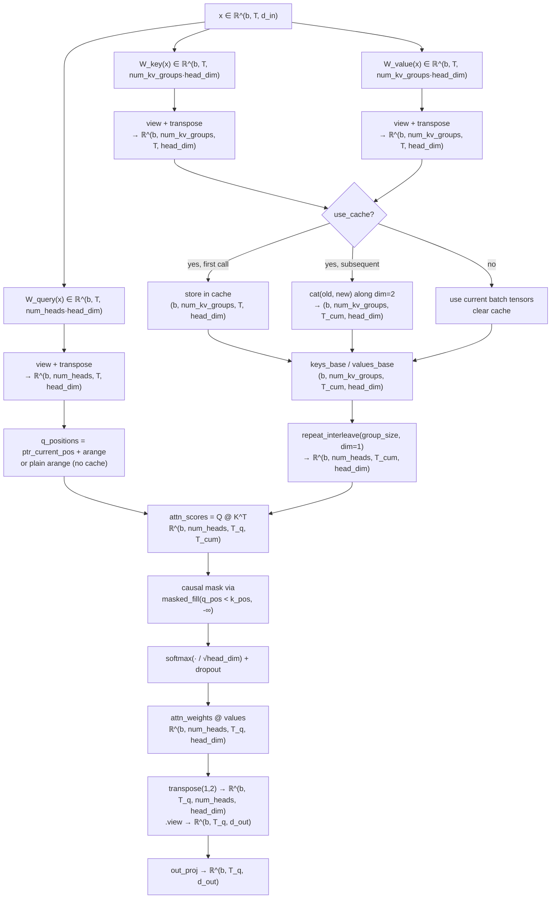
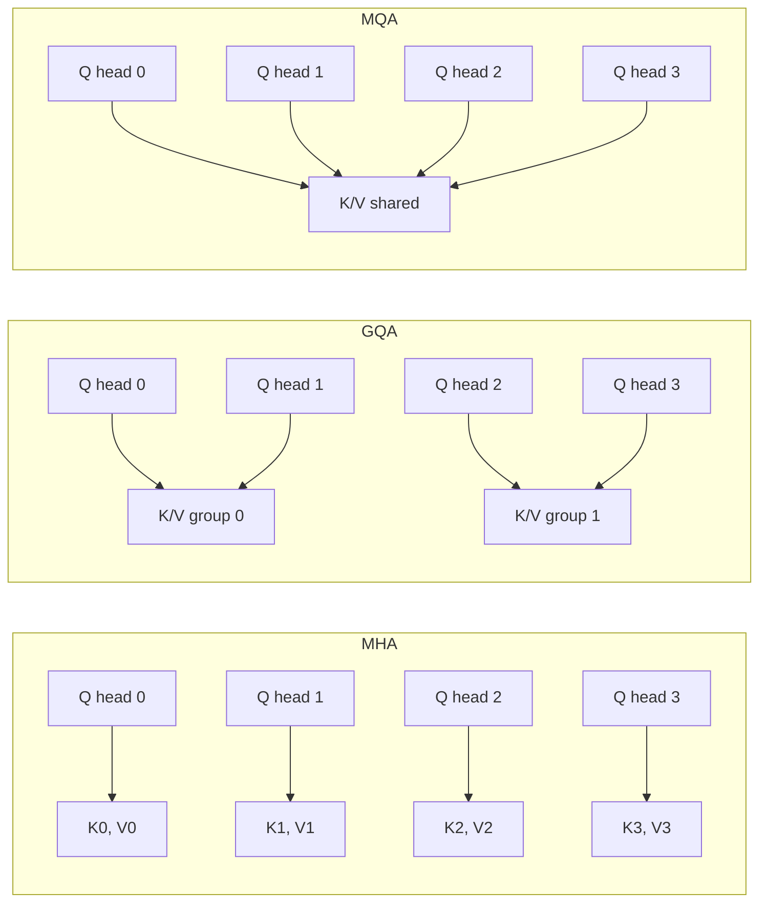

# Grouped-Query Attention — First-Principles Design Notes

## What is GQA?

Grouped-Query Attention (GQA, [Ainslie et al. 2023](https://arxiv.org/abs/2305.13245)) is the middle ground between **Multi-Head Attention (MHA)** and **Multi-Query Attention (MQA)**.

| Scheme | Query heads | Key/Value heads | KV cache cost | Typical use |
|---|---|---|---|---|
| **MHA** | `num_heads` | `num_heads` (each head gets its own K/V) | `num_heads · head_dim · T` | Full expressivity; high memory |
| **GQA** | `num_heads` | `num_kv_groups` (KV shared inside a group) | `num_kv_groups · head_dim · T` | Good expressivity/cost trade-off |
| **MQA** | `num_heads` | 1 (all heads share one K/V) | `1 · head_dim · T` | Lowest memory; may lose expressivity |

GQA partitions the query heads into `num_kv_groups` groups. Every query head **within a group shares one Key and one Value** pair. This preserves most of MHA's representational capacity while shrinking the KV-cache memory footprint by a factor of `num_heads / num_kv_groups`.

---

## Structural invariants (`__init__` contract)

```python
assert d_out % num_heads == 0         # → head_dim is integer
assert num_heads % num_kv_groups == 0 # → group_size is integer
```

- **Invariant 1** guarantees `head_dim = d_out // num_heads`. Every query head receives exactly `head_dim` elements of the projected output.
- **Invariant 2** guarantees `group_size = num_heads // num_kv_groups`. Each KV group covers a whole number of query heads; no partial groups.

---

## Asymmetric projections (the core of GQA)

The three linear layers have deliberately *different* output dimensions — this is the defining architectural choice:

| Projection | In → Out dim | Rationale |
|---|---|---|
| `W_query` | `d_in → d_out` (= `num_heads · head_dim`) | Every query head gets its own Q |
| `W_key` | `d_in → num_kv_groups · head_dim` | Only one key per group (not per head) |
| `W_value` | `d_in → num_kv_groups · head_dim` | Only one value per group |

Working example (124M config): `d_out=768`, `num_heads=12`, `num_kv_groups=2` →
`head_dim=64`, `group_size=6`. Key/value projections are `768 → 128` versus `768 → 768` in MHA.

---

## Step-by-step forward pass

Reference config for the worked shapes: `b=2`, `T=4`, `d_in=768`, `num_heads=12`, `num_kv_groups=2`, `head_dim=64`, `group_size=6`.

### Step 1 — Input
```
x: (2, 4, 768)
```

### Step 2 — Linear projections
```python
queries = W_query(x)   # (2, 4, 768)   = 12 heads × 64
keys    = W_key(x)     # (2, 4, 128)   =  2 groups × 64
values  = W_value(x)   # (2, 4, 128)
```

### Step 3 — Reshape to (batch, heads/groups, tokens, head_dim)
```python
queries → view(2,4,12,64) → transpose(1,2) → (2, 12, 4, 64)   # Q-heads
keys    → view(2,4, 2,64) → transpose(1,2) → (2,  2, 4, 64)   # KV-groups
values  → view(2,4, 2,64) → transpose(1,2) → (2,  2, 4, 64)
```

### Step 4 — KV-cache handling (see section below)

Either use the cached cumulative K/V or the current batch's K/V directly.

### Step 5 — Expand K/V to match query-head count (the GQA mechanism)
```python
keys   = keys_base.repeat_interleave(group_size, dim=1)   # (2, 2→12, 4, 64)
values = values_base.repeat_interleave(group_size, dim=1) # (2, 2→12, 4, 64)
```
`repeat_interleave` copies each KV group `group_size` times **in order**:
```
Before (group axis):                                          After (head axis):
  [K_group_0, K_group_1]               group_size=6 →          [K0, K0, K0, K0, K0, K0, K1, K1, K1, K1, K1, K1]
```
So query heads `0..5` attach to group 0's K/V and heads `6..11` attach to group 1's K/V. This alignment is correct only because `view` + `transpose` produces head indices in block order.

### Step 6 — Scaled dot-product attention
```python
attn_scores = queries @ keys.transpose(2, 3)   # (2, 12, 4, 4)
```

### Step 7 — Causal mask
```python
mask = q_positions.unsqueeze(-1) < k_positions.unsqueeze(0)   # (4, 4)
attn_scores = attn_scores.masked_fill(mask, -torch.inf)
```

### Step 8 — Softmax (+ dropout)
```python
attn_weights = softmax(attn_scores / head_dim**0.5, dim=-1)  # (2, 12, 4, 4)
attn_weights = dropout(attn_weights)
```

### Step 9 — Weighted sum with values
```python
context = attn_weights @ values   # (2, 12, 4, 64)
```

### Step 10 — Merge heads and project out
```python
context = context.transpose(1, 2)                    # (2, 4, 12, 64)
context = context.contiguous().view(2, 4, 768)       # concatenate 12 heads
out = out_proj(context)                               # (2, 4, 768) optional projection
```

---

## Forward-pass flowchart



---

## MHA vs GQA vs MQA — sharing structure



| | MHA | GQA | MQA |
|---|---|---|---|
| KV projection dim | `num_heads · head_dim` | `num_kv_groups · head_dim` | `head_dim` |
| KV cache per layer | `b · num_heads · T · head_dim` | `b · num_kv_groups · T · head_dim` | `b · 1 · T · head_dim` |
| Param overhead | highest | middle | lowest |

---

## KV cache design

### Cache shape
```python
self.cache_k  # (b, num_kv_groups, T_cumulative, head_dim)
self.cache_v  # (b, num_kv_groups, T_cumulative, head_dim)
```
Only **one row per group**, not per head — this is the memory win.

### Growth semantics
```python
if self.cache_k is None:
    self.cache_k, self.cache_v = keys_new, values_new     # seed
else:
    self.cache_k = torch.cat([self.cache_k, keys_new], dim=2)   # append along token axis
    self.cache_v = torch.cat([self.cache_v, values_new], dim=2)
```

### Causal mask with cache

The query-position pointer (`ptr_current_pos`) grows monotonically during cached generation. The mask `q_positions < k_positions` ensures the current token can never attend to future tokens, even as K/V extends:

```python
# Cache path:
q_positions = arange(ptr, ptr + T_q)       # e.g. [4, 5, 6, 7]
k_positions = arange(0, num_tokens_K)      # e.g. [0, 1, 2, 7]
mask = q_positions[:, None] < k_positions[None, :]   # (4, 8)

# No-cache path:
q_positions = arange(0, T_q)               # always [0, 1, ..., T_q-1]
k_positions = arange(0, T_q)               # same
```

### Cache vs no-cache trade-off

| | Without cache (full forward) | With cache (autoregressive) |
|---|---|---|
| Compute per step | Full `T` tokens | 1 token |
| Memory | recompute K/V every time | store K/V for all past tokens |
| Mask | always square | rectangular (growing KV, single Q) |
| Best for | training, prefill | multi-token generation |

---

## The `repeat_interleave` subtlety

```python
# Correct — keeps group ordering:
keys_base.repeat_interleave(group_size, dim=1)

# Wrong — would scramble group-to-head alignment:
keys_base.repeat(group_size, dim=1)
```

`repeat_interleave` vs `repeat` along `dim=1` (the head/group axis):

```
Group indices:                              [G0, G1]
repeat_interleave(3):  copies each group's rows in place →  [G0, G0, G0, G1, G1, G1]
repeat(3):            repeats the whole tiny block          →  [G0, G1, G0, G1, G0, G1]
```

`repeat_interleave` is correct because query heads produced by `view` + `transpose` have indices in the same block order:
- Head 0 → group 0, Head 1 → group 0, ..., Head `group_size-1` → group 0
- Head `group_size` → group 1, ..., Head `2·group_size-1` → group 1
- ...

`repeat` would scatter half of each group's query heads to the wrong K/V.

---

## Cache reset semantics

```python
def reset_cache(self):
    self.cache_k, self.cache_v = None, None
    self.ptr_current_pos = 0
```

This is called once at the start of each generation run (`generate_text_simple_cached`). It invalidates the persistent buffers set via `register_buffer("cache_k", None, persistent=False)`, which means the cache survives across `forward` calls within a generation but not across `model.eval()` / `model.train()` boundaries.

---

## References

- Ainslie et al., *GQA: Training Generalized Multi-Query Transformer Models from Multi-Head Checkpoints*, 2023. [arXiv:2305.13245](https://arxiv.org/abs/2305.13245)
- Touvron et al., *Llama 2: Open Foundation and Fine-Tuned Chat Models*, 2023. [arXiv:2307.09288](https://arxiv.org/abs/2307.09288)
- Source implementation: [`gpt_with_kv_gqa.py`](gpt_with_kv_gqa.py) in this directory.