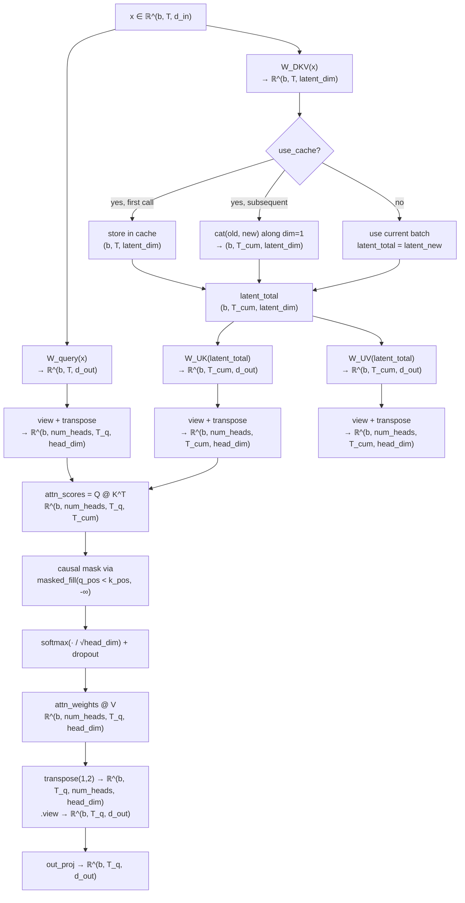
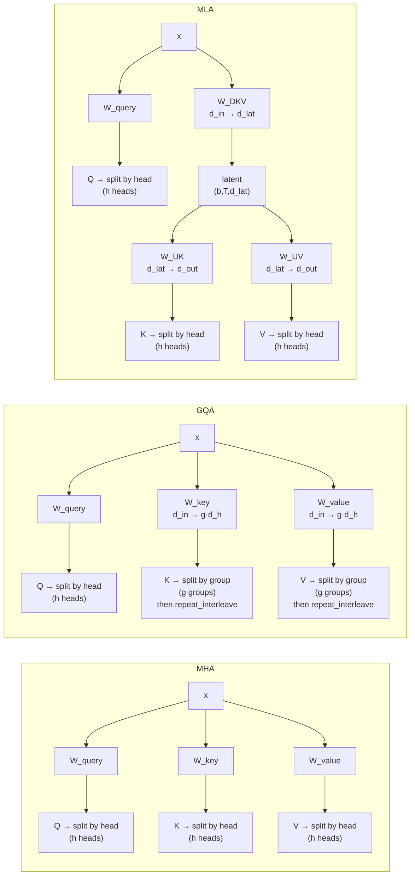

# Multi-Head Latent Attention — First-Principles Design Notes

## What is MLA?

Multi-Head Latent Attention (MLA, introduced in [DeepSeek-V2](https://arxiv.org/abs/2405.04434) and used in V3/R1) compresses the **key and value representations** into a low-dimensional **latent space** before storing them in the KV cache. At inference time the latent is projected back to per-head K/V via learned up-projection matrices.

This is a fundamentally different memory-saving strategy from GQA: instead of making K/V *shared* across query heads, MLA makes K/V *compressed* into a bottleneck. The up-projections learn distinct per-head keys and values from the same latent — so there is no group-induced representational loss.

| Scheme | Q projection | K projection | V projection | KV cache stores | Cache size per layer (`b·T`) |
|---|---|---|---|---|---|
| **MHA** | `d_in → d_out` | `d_in → d_out` | `d_in → d_out` | `K(b,h,T,d_h)` + `V(b,h,T,d_h)` | `2·d_out` elements |
| **GQA** | `d_in → d_out` | `d_in → g·d_h` | `d_in → g·d_h` | `K(b,g,T,d_h)` + `V(b,g,T,d_h)` | `2·d_out·g/h` elements |
| **MLA** | `d_in → d_out` | `d_in → d_lat → d_out` | `d_in → d_lat → d_out` | `c_kv(b,T,d_lat)` **(one tensor)** | `d_lat` elements |

`d_h = head_dim`, `d_out = h·d_h`, `g = num_kv_groups`, `h = num_heads`, `d_lat = latent_dim`.

**Key insight**: MLA stores a single compressed tensor of shape `(b, T, latent_dim)` instead of two full tensors of shape `(b, h, T, d_h)` each. The saving ratio vs MHA is:

```
MHA cache size per layer  = 2 · b · T · d_out
MLA cache size per layer  =     b · T · latent_dim
Ratio (MHA / MLA)         = 2 · d_out / latent_dim
```

With `d_out=768, latent_dim=96` that is a **16× reduction** over MHA, and comparable to GQA with 6 groups.

---

## Structural invariants (`__init__` contract)

```python
assert d_out % num_heads == 0       # → head_dim is integer
assert latent_dim > 0               # → latent dimension is positive
```

- **Invariant 1** guarantees `head_dim = d_out // num_heads`. Every query head receives exactly `head_dim` elements of the projected output. This is the same invariant as MHA.
- **Invariant 2** is trivial — no lower bound is imposed and `latent_dim` is a free hyperparameter (defaults to `max(16, d_out // 8)`).

There is **no** `num_heads % num_kv_groups == 0` constraint because MLA does not group heads. Every head gets its own K/V after up-projection.

---

## Asymmetric projections (the core of MLA)

The critical architectural choice is that Keys and Values are **not** computed via a direct `Linear(d_in, d_out)` from the input. They go through a **bottleneck**:

| Projection | In → Out dim | Role | Cache impact |
|---|---|---|---|
| `W_query` | `d_in → d_out` (= `num_heads · head_dim`) | Per-head queries (same as MHA) | Not cached |
| `W_DKV` | `d_in → latent_dim` | **Compress** input to shared latent | This is what gets cached |
| `W_UK` | `latent_dim → d_out` (= `num_heads · head_dim`) | **Up-project** latent to per-head keys | Applied at inference time |
| `W_UV` | `latent_dim → d_out` (= `num_heads · head_dim`) | **Up-project** latent to per-head values | Applied at inference time |

Working example (124M-style config): `d_in=768`, `d_out=768`, `num_heads=12`, `head_dim=64`, `latent_dim=96` →

Key/value projections are `768 → 96 → 768` versus `768 → 768` in MHA. The intermediate latent is only **96-dimensional**.

The two-step chain `W_DKV` → `W_UK`/`W_UV` is a **low-rank factorization** of what would otherwise be a full `d_in → d_out` key/value projection. The rank is bounded by `latent_dim = 96`. The hypothesis is that per-head keys and values live in a low-dimensional subspace — the shared latent captures what is common across heads, and `W_UK`/`W_UV` learn head-specific linear readouts.

---

## Step-by-step forward pass

Reference config for the worked shapes: `b=2`, `T=4` (prefill), `T_cum=8` (cached), `d_in=768`, `num_heads=12`, `head_dim=64`, `d_out=768`, `latent_dim=96`.

### Step 1 — Input
```
x: (2, 4, 768)
```

### Step 2 — Linear projections
```python
queries_all = W_query(x)   # (2, 4, 768)   = 12 heads × 64  (per-head Q)
latent_new  = W_DKV(x)     # (2, 4, 96)    = compressed latent (shared K/V rep)
```

Only two projections happen here (Q and the compressed latent), compared to three in MHA (Q, K, V). The K/V computation is deferred.

### Step 3 — Latent cache update
```python
if use_cache:
    if self.cache_c_kv is None:
        latent_total = latent_new                           # (2, 4, 96)
    else:
        latent_total = torch.cat([self.cache_c_kv, latent_new], dim=1)  # (2, 8, 96)
    self.cache_c_kv = latent_total                          # store compressed latent
else:
    latent_total = latent_new                               # (2, 4, 96)
```

### Step 4 — Up-project latent to per-head keys and values
```python
keys_all   = W_UK(latent_total)   # (2, T_cum, 768)   = 12 heads × 64
values_all = W_UV(latent_total)   # (2, T_cum, 768)
```

This replaces the direct `W_key(x)` / `W_value(x)` of MHA. The up-projections are applied to the **entire cumulative latent sequence** during cached generation.

### Step 5 — Reshape to (batch, heads, tokens, head_dim)
```python
queries_all → view(2, T_q, 12, 64) → transpose(1,2) → (2, 12, T_q, 64)   # Q-heads
keys_all    → view(2, T_K, 12, 64) → transpose(1,2) → (2, 12, T_K, 64)   # K-heads
values_all  → view(2, T_K, 12, 64) → transpose(1,2) → (2, 12, T_K, 64)   # V-heads
```

Every head gets its own K and V — **unlike GQA, no `repeat_interleave` is needed**.

### Step 6 — Scaled dot-product attention
```python
attn_scores = queries @ keys.transpose(-2, -1)   # (2, 12, T_q, T_K)
```

### Step 7 — Causal mask
```python
mask = q_positions.unsqueeze(-1) < k_positions.unsqueeze(0)   # (T_q, T_K)
attn_scores = attn_scores.masked_fill(mask, -torch.inf)
```

### Step 8 — Softmax (+ dropout)
```python
attn_weights = softmax(attn_scores / head_dim**0.5, dim=-1)  # (2, 12, T_q, T_K)
attn_weights = dropout(attn_weights)
```

### Step 9 — Weighted sum with values
```python
context = attn_weights @ values   # (2, 12, T_q, 64)
```

### Step 10 — Merge heads and project out
```python
context = context.transpose(1, 2)                          # (2, T_q, 12, 64)
context = context.contiguous().view(2, T_q, 768)           # concatenate 12 heads
out = out_proj(context)                                     # (2, T_q, 768)
```

---

## Forward-pass flowchart



---

## MHA vs GQA vs MLA — projection paths and cache contents



| | MHA | GQA | MLA |
|---|---|---|---|
| KV projection path | `d_in → d_out` (direct, per head) | `d_in → g·d_h` (reduced, per group) | `d_in → d_lat → d_out` (bottleneck) |
| Cache content per layer | `K(b,h,T,d_h)` + `V(b,h,T,d_h)` | `K(b,g,T,d_h)` + `V(b,g,T,d_h)` | `c_kv(b,T,d_lat)` **(single tensor)** |
| K/V per head | Fully independent | Shared within groups | Independent after up-projection |
| Param count (Q+K+V proj) | `3·d_in·d_out` | `d_in·d_out + 2·d_in·g·d_h` | `d_in·d_out + d_in·d_lat + 2·d_lat·d_out` |
| Expressivity vs MHA | — | Lower (hard sharing) | Comparable (learned up-projection) |

---

## KV cache design

### Cache shape — this is the entire memory win
```python
self.cache_c_kv  # (b, T_cumulative, latent_dim)
```

A **single tensor** of shape `(batch, tokens, latent_dim)`, versus MHA which stores `(b, h, T, d_h)` for keys **and** `(b, h, T, d_h)` for values. The latent representation is shared across both K and V and across all heads.

### Growth semantics
```python
if self.cache_c_kv is None:
    self.cache_c_kv = latent_new                            # seed: (b, T, latent_dim)
else:
    self.cache_c_kv = torch.cat(                            # append along token axis
        [self.cache_c_kv, latent_new], dim=1
    )
```

### Deferred K/V computation
Unlike MHA/GQA where keys and values are computed **before** caching, MLA computes only the compressed latent before caching. The up-projections `W_UK` and `W_UV` run **after** the cache lookup, on the full `latent_total` tensor (cached past + new tokens). This means:

```
Prefill:  W_DKV(x_prefill)         → cache c_kv       → W_UK(c_kv) → K, W_UV(c_kv) → V
Step t:   W_DKV(x_t)               → append to cache   → W_UK(cache) → K, W_UV(cache) → V
```

At every generation step you must up-project the **entire cumulative latent** (past + new), not just the new token. This is a computational overhead vs GQA (which only needs the new token's K/V for the cache and can expand with `repeat_interleave`). The pay-off is the significant memory saving from storing `latent_dim` rather than `2 × d_out` per token.

### Causal mask with cache

```python
# Cache path:
q_positions = arange(ptr, ptr + T_q)       # e.g. [4] for single-token generation
k_positions = arange(0, num_tokens_K)      # e.g. [0, 1, 2, 3, 4, 5, 6, 7] for full cache
mask = q_positions[:, None] < k_positions[None, :]   # (T_q, T_cum)

# No-cache path:
q_positions = arange(0, T_q)               # always [0, 1, ..., T_q-1]
k_positions = arange(0, T_K)               # same
```

Identical logic to MHA/GQA — the pointer `ptr_current_pos` tracks absolute position so causal masking remains correct as K/V grows.

### Cache vs no-cache trade-off

| | Without cache (full forward) | With cache (autoregressive) |
|---|---|---|
| Compute per step | Full `T` tokens through W_query, W_DKV, W_UK, W_UV | 1 new token through W_query, W_DKV; full `T_cum` through W_UK, W_UV |
| Cache write | None | Append latent `(b, 1, latent_dim)` |
| Cache read | None | Up-project full latent → `K(b,h,T_cum,d_h)` + `V(b,h,T_cum,d_h)` |
| Memory | Recompute K/V each time | Store latent for all past tokens |
| Best for | Training, prompt prefill | Multi-token generation |

**Important**: The up-projection `W_UK`/`W_UV` runs on the **full cumulative sequence** during cached generation (not just the new token). This means the attention step gets the same `(b, h, T_cum, d_h)` K/V tensors it would in MHA — there is no approximation from the cache. The extra FLOPs of up-projecting the full history are the price paid for not storing K/V directly.

---

## The latent compression subtlety: MLA vs GQA expressivity

Both MLA and GQA reduce KV-cache memory. But they achieve the reduction through **qualitatively different mechanisms**:

### GQA — hard sharing
```
K/V per head = K/V_group[head // group_size]   # literal index copy
```
Heads within a group receive identical K/V vectors. There is no learned transformation; the sharing is a hard constraint.

### MLA — learned bottleneck (low-rank factorization)
```
K_h(x) = W_UK_h( W_DKV(x) )    # slice of up-projection for head h
V_h(x) = W_UV_h( W_DKV(x) )
```
Even though `c_kv = W_DKV(x)` is shared across all heads, the up-projections `W_UK` and `W_UV` are **learned weight matrices** of shape `(latent_dim, d_out)`. Each head `h` gets its own slice `W_UK_h` of shape `(latent_dim, head_dim)`. These slices can learn **different features** from the same latent representation.

The combined transformation `W_DKV → W_UK` is a low-rank approximation of what MHA's `W_key` does directly:

```
MHA:  key_h(x) = W_key_h(x)           # rank ≤ min(d_in, head_dim)
MLA:  key_h(x) = W_UK_h(W_DKV(x))     # rank ≤ min(d_in, latent_dim, head_dim)
```

When `latent_dim < head_dim`, MLA imposes a stricter rank constraint. The empirical finding from DeepSeek's ablation studies is that this constraint can actually **regularize** the attention mechanism, improving generalization over MHA — unlike GQA which tends to slightly degrade performance.

### Summary
```
MHA:  high rank per head, high memory
GQA:  medium rank, low memory (hard sharing, no learned readout)
MLA:  low rank via bottleneck, lowest memory, learned per-head readout
```

---

## The `_reshape_to_heads` helper

Unlike GQA where keys/values must be reshaped to `(b, num_kv_groups, T, head_dim)` (different from queries `(b, num_heads, T, head_dim)`), MLA's `W_UK` and `W_UV` already produce `d_out`-dimensional outputs, so all three tensors have the same trailing dimension:

```python
@staticmethod
def _reshape_to_heads(x, num_heads, head_dim):
    # (b, T, d_out) → (b, num_heads, T, head_dim)
    bsz, num_tokens, _ = x.shape
    return x.view(bsz, num_tokens, num_heads, head_dim).transpose(1, 2).contiguous()
```

This single helper handles queries, keys, and values uniformly — a consequence of up-projecting all the way back to `d_out` rather than stopping at `num_kv_groups · head_dim`.

---

## Cache reset semantics

```python
def reset_cache(self):
    self.cache_c_kv = None
    self.ptr_current_pos = 0
```

Called once at the start of each generation run (`generate_text_simple_cached`). Because `cache_c_kv` is registered via `register_buffer("cache_c_kv", None, persistent=False)`, it survives across `forward` calls within a generation run but not across `model.eval()` / `model.train()` boundaries.

---

## References

- DeepSeek-AI, *DeepSeek-V2: A Strong, Economical, and Efficient Mixture-of-Experts Language Model*, 2024. [arXiv:2405.04434](https://arxiv.org/abs/2405.04434)
- DeepSeek-AI, *DeepSeek-V3 Technical Report*, 2024. [arXiv:2412.19437](https://arxiv.org/abs/2412.19437)
- Source implementation: [`gpt_with_kv_mla.py`](gpt_with_kv_mla.py) in this directory, inspired by [bird-of-paradise/deepseek-mla](https://huggingface.co/bird-of-paradise/deepseek-mla) on HuggingFace.
- Comparison MHA implementation: [`gpt_with_kv_mha.py`](gpt_with_kv_mha.py) in this directory.