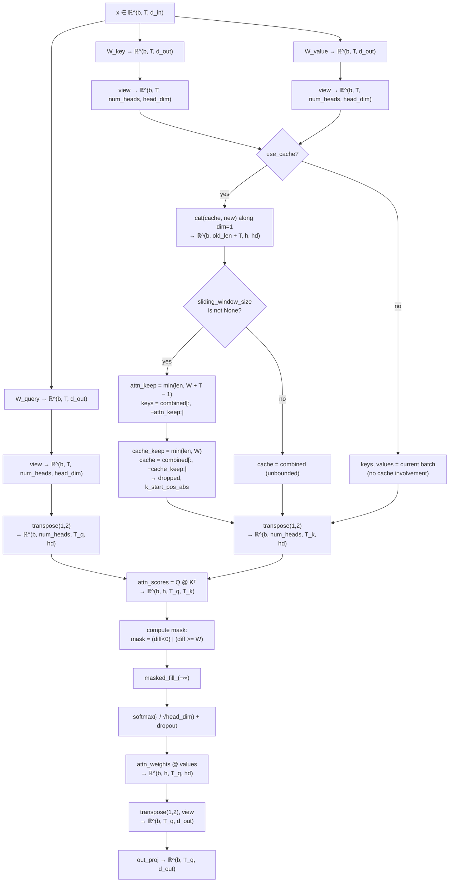
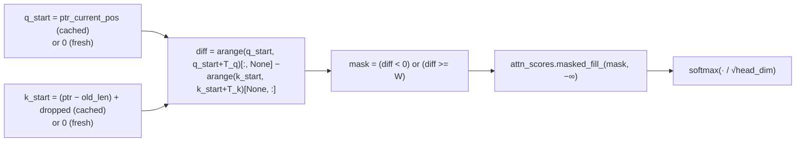

# Sliding-Window Attention — First-Principles Design Notes

## What is SWA?

Sliding-Window Attention (SWA, [Mistral 7B — Jiang et al. 2023](https://arxiv.org/abs/2310.06825)) keeps the causal-mask discipline of standard GPT attention but **limits every query to the `W` most recent key/value positions**. It is a drop-in replacement for the attention block: same projections, same head count, same output shape — only the mask and the KV cache lifecycle change.

| | Full attention (MHA) | Sliding window (SWA, width W) |
|---|---|---|
| Score matrix per call | `T_q × T` (all history) | `T_q × min(T, W + T_q − 1)` |
| KV cache size | `num_heads · head_dim · T` (grows without bound) | `num_heads · head_dim · W` (bounded) |
| Decode-step compute | `O(T)` per token | `O(W)` per token (constant after warm-up) |
| Effective context | T tokens | W tokens |
| Rationale | maximum expressivity | language is locally coherent; the quadratic `O(T²)` cost of full attention dominates at long sequence lengths |

The class is **parametric in the window**: `sliding_window_size=None` degenerates to plain causal MHA (the layer is "regular"); an integer `W` activates the sliding band. The `GPTModel` uses this feature to interleave SWA layers with full-attention layers in a K:1 schedule (discussed in the Integration section).

---

## Structural invariants (`__init__` contract)

```python
def __init__(self, d_in, d_out, dropout, num_heads,
             qkv_bias=False, sliding_window_size=None):
    super().__init__()
    assert d_out % num_heads == 0, "d_out must be divisible by num_heads"

    self.d_out = d_out
    self.num_heads = num_heads
    self.head_dim = d_out // num_heads

    self.W_query = nn.Linear(d_in, d_out, bias=qkv_bias)
    self.W_key   = nn.Linear(d_in, d_out, bias=qkv_bias)
    self.W_value = nn.Linear(d_in, d_out, bias=qkv_bias)
    self.out_proj = nn.Linear(d_out, d_out)
    self.dropout = nn.Dropout(dropout)
    self.sliding_window_size = sliding_window_size

    ### KV Cache related
    self.register_buffer("cache_k", None, persistent=False)
    self.register_buffer("cache_v", None, persistent=False)
    self.ptr_current_pos = 0
```

- **Invariant**: `head_dim = d_out // num_heads` is an integer, so the projected output can always be unfolded into `num_heads` equal slices. SWA is symmetric (unlike GQA), so there are no extra divisibility rules beyond standard MHA.
- **`sliding_window_size`** is a *behavior switch*, not an extra parameter tensor: `None` → full causal attention; `int` → window of that width.
- **KV cache state** is three scalars/buffers:
  - `cache_k`, `cache_v` — registered PyTorch *buffers* (survive `.to(device)`), `persistent=False` (excluded from `state_dict`), initialized `None` (empty cache).
  - `ptr_current_pos` — a Python `int`, the **absolute position of the first token of the *next* chunk**. It is the single source of truth that keeps the mask and the cache aligned even after the cache is front-trimmed.

---

## The `sliding_window_size` contract

| `self.sliding_window_size` | Effect on mask | Effect on cache | Effective context |
|---|---|---|---|
| `None` | `W = num_tokens_K + 1`, so only `diff < 0` fires → pure causal triangle | unbounded (every token retained) | full sequence |
| `int W` | band `0 ≤ q − k < W`: both future and stale keys masked | bounded to last `W` tokens | `W` tokens |

---

## Step-by-step forward pass

Worked reference config for shape annotations: `b = 2`, chunk `T = 4`, `d_in = d_out = 768`, `num_heads = 12`, `head_dim = 64`, `W = 6`, cache already at capacity spanning absolute positions `[s − 6, s)`.

### Step 1 — Linear projections

```python
b, num_tokens, d_in = x.shape     # (2, 4, 768)

keys_new   = self.W_key(x)   # (2, 4, 768)
values_new = self.W_value(x) # (2, 4, 768)
queries    = self.W_query(x) # (2, 4, 768)
```

`num_tokens` (aliased as `T` below) is the **chunk size**: 4 during prefill or chunked inference, 1 during token-by-token decode.

### Step 2 — Head split via `view` (no data movement)

```python
keys_new   = keys_new.view(b, num_tokens, self.num_heads, self.head_dim)
values_new = values_new.view(b, num_tokens, self.num_heads, self.head_dim)
queries    =      queries.view(b, num_tokens, self.num_heads, self.head_dim)
# each → (2, 4, 12, 64)
```

The trailing `d_out` axis of each projection is reinterpreted as `(num_heads, head_dim)`. After this, every K/V/Q tensor is 4-D: `(batch, tokens, heads, head_dim)`.

### Step 3 — KV-cache merge and **double trim** (the SWA-specific machinery)

```python
if use_cache:
    old_cache_k, old_cache_v = self.cache_k, self.cache_v
    old_len = 0 if old_cache_k is None else old_cache_k.size(1)
    if old_cache_k is None:
        combined_k, combined_v = keys_new, values_new
    else:
        combined_k = torch.cat([old_cache_k, keys_new], dim=1)   # (2, old_len+4, 12, 64)
        combined_v = torch.cat([old_cache_v, values_new], dim=1)

    keys, values = combined_k, combined_v
    if self.sliding_window_size is not None:
        # attn_keep — how many keys the CURRENT matmul sees
        attn_keep = min(keys.size(1), self.sliding_window_size + num_tokens - 1)
        keys   = keys[:,   -attn_keep:, :, :]
        values = values[:, -attn_keep:, :, :]

        # cache_keep — how many keys are STORED for the next call
        cache_keep = min(combined_k.size(1), self.sliding_window_size)
        self.cache_k = combined_k[:, -cache_keep:, :, :]
        self.cache_v = combined_v[:, -cache_keep:, :, :]
    else:
        self.cache_k, self.cache_v = combined_k, combined_v

    dropped = combined_k.size(1) - keys.size(1)
    k_start_pos_abs = (self.ptr_current_pos - old_len) + dropped
    q_start_pos_abs = self.ptr_current_pos
else:
    keys, values = keys_new, values_new
```

Two distinct trim widths serve two purposes:

| Variable | Expression | Purpose |
|---|---|---|
| `attn_keep` | `min(total_len, W + T − 1)` | how many keys the **current attention matmul** sees |
| `cache_keep` | `min(total_len, W)` | how many keys are **stored for the next call** |

The `+ num_tokens − 1` in `attn_keep` is the key insight for **chunked prefill**: the earliest query in the current chunk must still see its full window of `W − 1` *predecessors*, so the attention slice must keep the whole chunk plus up to `W − 1` older keys:

```
combined (= cache W=6   +  current chunk T=4), absolute positions:
┌──────────────────────────────────────────────────┐
│ s-6 s-5 s-4 s-3 s-2 s-1 │ s  s+1  s+2  s+3      │
└──────────────────────────────────────────────────┘
         cache_keep = W = 6  (stored for next step: s-2 … s+3)
              attn_keep = W + T − 1 = 9  (seen by matmul: s-5 … s+3)
                                     dropped = (6+4) − 9 = 1
```

The bookkeeping line
```python
k_start_pos_abs = (self.ptr_current_pos - old_len) + dropped
```
reconstructs the **absolute position of the first surviving key**:
- `ptr_current_pos − old_len` is where the old cache started (since the cache was trimmed to its last `old_len` entries on the *previous* step).
- `+ dropped` shifts past whatever this step discarded from the front of `combined`.

In the worked example: `k_start = (s − 6) + 1 = s − 5`, exactly the first surviving key. This single number is what keeps the mask truthful after trimming (see "The absolute-position subtlety" below).

### Step 4 — Transpose to per-head layout

```python
keys    = keys.transpose(1, 2)      # (2, 12, 9, 64)
queries = queries.transpose(1, 2)   # (2, 12, 4, 64)
values  = values.transpose(1, 2)    # (2, 12, 9, 64)
```

Note `queries` is **never** cached — only the current chunk's queries are ever computed. This is correct because generation queries are always the newest tokens and never need to be replayed.

### Step 5 — Scaled dot-product scores

```python
attn_scores = queries @ keys.transpose(2, 3)   # (2, 12, 4, 9)
```

### Step 6 — Causal **and** sliding-window mask

```python
num_tokens_Q = queries.shape[-2]   # 4
num_tokens_K = keys.shape[-2]      # 9
device = queries.device
if use_cache:
    q_start = q_start_pos_abs      # s
    k_start = k_start_pos_abs      # s-5
else:
    q_start = 0
    k_start = 0
q_positions = torch.arange(q_start, q_start + num_tokens_Q, device=device, dtype=torch.long)
k_positions = torch.arange(k_start, k_start + num_tokens_K, device=device, dtype=torch.long)
W = num_tokens_K + 1 if self.sliding_window_size is None else int(self.sliding_window_size)
diff = q_positions.unsqueeze(-1) - k_positions.unsqueeze(0)   # (4, 9)
mask_bool = (diff < 0) | (diff >= W)
if use_cache:
    self.ptr_current_pos += num_tokens_Q
else:
    self.ptr_current_pos = 0
attn_scores.masked_fill_(mask_bool, -torch.inf)
```

The mask is a single boolean over the **absolute-position difference** `q − k`:
- `diff < 0` → key is in the future → causal block.
- `diff >= W` → key is older than the window → sliding block.

(The sentinel `W = num_tokens_K + 1` when `sliding_window_size is None` guarantees the second clause can never fire: the maximum reachable difference `q − k` is `num_tokens_K − 1 < num_tokens_K + 1 = W`. So a "regular" layer reduces to the pure-causal triangle.)

### Step 7 — Scale, softmax, dropout

```python
attn_weights = torch.softmax(attn_scores / keys.shape[-1]**0.5, dim=-1)  # √head_dim = 8
attn_weights = self.dropout(attn_weights)
```

### Step 8 — Context, head merge, output projection

```python
context_vec = (attn_weights @ values).transpose(1, 2)              # (2, 4, 12, 64)
context_vec = context_vec.contiguous().view(b, num_tokens, self.d_out)  # (2, 4, 768)
context_vec = self.out_proj(context_vec)
return context_vec
```

---

## Forward-pass flowchart



## Mask construction flowchart



---

## The causal sliding-window mask, from first principles

### The (q, k) position plane

Every allowed pair `(q, k)` satisfies **`0 ≤ q − k < W`**: the key must be current-or-past (`q − k ≥ 0`) and no older than `W − 1` tokens before the query (`q − k < W`). On the `(q, k)` difference grid (q increasing downward, k increasing rightward), the allowed cells form a **band of width W hugging the diagonal**:

```
W = 4, positions 0..7, training / no-cache (T_q = T_k = 8)

■ keep   ▓ future (q < k)     ▒ too old (q − k ≥ W)

q\k  0   1   2   3   4   5   6   7
 0   ■   ▓   ▓   ▓   ▓   ▓   ▓   ▓
 1   ■   ■   ▓   ▓   ▓   ▓   ▓   ▓
 2   ■   ■   ■   ▓   ▓   ▓   ▓   ▓
 3   ■   ■   ■   ■   ▓   ▓   ▓   ▓
 4   ▒   ■   ■   ■   ■   ▓   ▓   ▓
 5   ▒   ▒   ■   ■   ■   ■   ▓   ▓
 6   ▒   ▒   ▒   ■   ■   ■   ■   ▓
 7   ▒   ▒   ▒   ▒   ■   ■   ■   ■
```

Row `q` keeps columns `[q − W + 1, q]`. Row 3 keeps cols 1–3 (its full window with no older history available). Row 7 keeps cols 4–7 (predecessors within the window).

### From training to decode

With a KV cache the same band is defined on **absolute** positions. Query at absolute position `p` keeps keys in `[p − W + 1, p]`, regardless of where the trimmed key slice happens to start. During token-by-token decode the mask collapses to a single row — the band persists, but only one query position at a time:

```
Decode with W = 4, cache already at capacity:

                         time ──────────────────────────►
absolute positions:      0  1  2  3  4  5  6  7
                         └─prefill─┘└──── decode ────┘
step: process token 4    keys seen = [1 2 3 4]   → q=4 attends to {1,2,3,4}
step: process token 5    keys seen = [2 3 4 5]   → q=5 attends to {2,3,4,5}
step: process token 6    keys seen = [3 4 5 6]   → q=6 attends to {3,4,5,6}
step: process token 7    keys seen = [4 5 6 7]   → q=7 attends to {4,5,6,7}
```

### Why `W = num_tokens_K + 1` when the window is `None`

If the layer is regular (window off), the sliding clause must be inert. The largest difference that can physically occur is the newest query against the oldest key: `(q_start + T_q − 1) − k_start ≤ num_tokens_K − 1`. Setting `W = num_tokens_K + 1` places the entire feasible range strictly below `W`, so only the causal clause `diff < 0` can ever fire. The cache then grows unboundedly, exactly like the sibling MHA-with-cache file.

---

## KV cache mechanism

### Growth and trim in one place

The cache is seeded on the first call (the prefill pass) and grows by concatenation on every subsequent call. For SWA layers, the **front** of `combined` is then discarded twice with different widths. The cache self-limits: after at most `W` tokens are resident, every step drops exactly the oldest, keeping the store at constant size `W`:

```
cache evolution, W = 4 (brackets = stored; relevance band shown for the newest q):

prefill [0 1 2 3]
    after tok 4 → [1 2 3 4]
    after tok 5 → [2 3 4 5]
    after tok 6 → [3 4 5 6]
    after tok 7 → [4 5 6 7]
    ... always the last W tokens
```

`dropped` records how many keys fell off the *front* of the attention slice; its only consumer is the absolute-position bookkeeping that immediately follows.

### Decode walkthrough (W = 4)

| call | input | `ptr` pre | combined span | attn keys (kept) | cache after | `q_start` | `k_start` | `dropped` |
|---|---|---|---|---|---|---|---|---|
| prefill `[0..3]` | `[0..3]` | 0 | `[0..3]` | `[0..3]` | `[0..3]` | 0 | 0 | 0 |
| tok 4 | `[4]` | 4 | `[0..4]` | `[1..4]` | `[1..4]` | 4 | 1 | 1 |
| tok 5 | `[5]` | 5 | `[1..5]` | `[2..5]` | `[2..5]` | 5 | 2 | 1 |
| tok 6 | `[6]` | 6 | `[2..6]` | `[3..6]` | `[3..6]` | 6 | 3 | 1 |
| tok 7 | `[7]` | 7 | `[3..7]` | `[4..7]` | `[4..7]` | 7 | 4 | 1 |

Every decode query gets exactly `W = 4` valid keys (`diff = 3, 2, 1, 0` — none masked). Compute and memory stay flat at `O(W)` no matter how long the sequence runs.

### Chunked prefill diagram (W = 6, C = 4, cache at capacity)

```mermaid
block-beta
    columns 10
    block:CacheBefore["Cache before (W=6)"]
        A["s-6"] B["s-5"] C["s-4"] D["s-3"] E["s-2"] F["s-1"]
    end
    space
    block:Chunk["Current chunk (C=4)"]
        G["s"] H["s+1"] I["s+2"] J["s+3"]
    end
    space
    block:Dropped["Dropped from front (dropped=1)"]
        K["s-6"]
    end
    space
    block:Kept["Kept for matmul (attn_keep = W+C-1 = 9)"]
        L["s-5"] M["s-4"] N["s-3"] O["s-2"] P["s-1"] Q["s"] R["s+1"] S["s+2"] T["s+3"]
    end
    space
    block:CacheAfter["Cache after (cache_keep = W = 6)"]
        U["s-2"] V["s-1"] W2["s"] X["s+1"] Y["s+2"] Z["s+3"]
    end
end
```

### The absolute-position subtlety

The mask **must** use absolute positions, not slice-relative indices — because after trimming, the key slice no longer starts at 0. Trace the buggy version (naive `k_positions = arange(T_k)`) for decode of token 7 with `W = 4`:

```
True keys = absolute [4, 5, 6, 7],  query = absolute 7
naive   →   k_pos = [0, 1, 2, 3]      diff = [7, 6, 5, 4]
                all satisfy diff ≥ 4   ⇒  every cell masked ⇒ softmax over all −∞ ⇒ NaN

correct →   k_pos = [4, 5, 6, 7]      diff = [3, 2, 1, 0]
                all within [0, W)      ⇒ band intact
```

`k_start_pos_abs = (ptr_current_pos − old_len) + dropped` is precisely the fix: `ptr − old_len` locates the cache's first element and `+ dropped` adjusts for this step's front-trim. For regular layers (`dropped = 0`, cache from position 0), it degenerates to 0, matching the MHA file.

### Cache lifecycle details

```python
self.register_buffer("cache_k", None, persistent=False)   # device-aware, not in state_dict
...
def reset_cache(self):
    self.cache_k, self.cache_v = None, None
    self.ptr_current_pos = 0
```

- Buffers follow `.to(device)` / `.to(dtype)` automatically even when seeded with `None`.
- `persistent=False` keeps KV state out of checkpoints — it is transient generation state, not a model parameter.
- `reset_cache` is invoked once per generation run by `generate_text_simple_cached` (before the prefill pass) and must reset **all** layers, which is why `GPTModel.reset_kv_cache` loops over `TransformerBlock` instances.
- When `use_cache=False` (training), `ptr_current_pos` is re-zeroed on every `forward` call, so cached and training paths can never leak position state.

---

## KV cache: before vs after trim (decode step, W = 4)

```mermaid
block-beta
    columns 6
    block:Combined["combined (= old cache [0..3] + new tok 4)"]
        A["0"] B["1"] C["2"] D["3"] E["4"]
    end
    space
    block:Trimmed["trimmed: attn_keep=4 (drop idx 0), cache_keep=4 (drop idx 0)"]
        F["1"] G["2"] H["3"] I["4"]
    end
end
```

---

## Decode vs. chunked prefill vs. training

| Mode | `num_tokens` per call | Cache used | `attn_keep` | Typical mask shape |
|---|---|---|---|---|
| Training / full forward | full context `T` | unused | n/a | `T × T` band |
| Prefill (one shot) | full prompt `T` | seeded, trimmed to `min(T,W)` | `min(T, W+T−1) = T` | square band |
| Chunked prefill | chunk `C` | used, steady `W` | `min(len, W+C−1)` | `C × (W+C−1)` band |
| Decode | 1 | used, steady `W` | `W` | `1 × W` row |

The `+C−1` in `attn_keep` is what makes **chunked** prefill correct: without it, the earliest query of each chunk would silently lose `W−1` tokens of context it is entitled to.

---

## SWA vs. the sibling MHA-with-cache baseline

The only differences from `gpt_with_kv_mha.py` are four compact, logically independent edits. Everything else (projections, reshape, softmax, merge, `out_proj`) is byte-for-byte the same:

| Concern | `MultiHeadAttention` (kv MHA) | `MultiHeadAttentionWithSWA` (from this file) |
|---|---|---|
| Constructor parameter | — | `sliding_window_size` |
| Cache growth | unbounded `cat`, no trim | unbounded `cat` + front-trim via two widths |
| Trim widths | none | `attn_keep` (for the current matmul) and `cache_keep` (for storage) |
| Key positions in mask | `arange(T_k)` (always starts at 0) | `arange(k_start, k_start + T_k)` with absolute `k_start` |
| Mask condition | `diff < 0` | `(diff < 0) \| (diff >= W)` |
| Window sentinel when off | — | `W = T_k + 1` when `sliding_window_size is None` |

---

## Integration: the K:1 layer schedule

The class does not set its own window — `GPTModel.__init__` does, per layer, using the K:1 schedule from the config:

```python
K = int(window_stride)                     # e.g. 2 → "2 SWA layers per 1 regular layer"
if K <= 0:
    use_swa = False if K == 0 else True    # 0 → all regular, <0 → all SWA
else:
    group = K + 1
    use_swa = (i % group) < K              # layers 0,1 SWA · 2 regular · 3,4 SWA · ...
blk.att.sliding_window_size = window_size if use_swa else None
```

Regular layers (`None`) run the code path where the sliding clause is inert and the cache grows forever; SWA layers (`int W`) bound their cache at `W`. The attention class is reused for both roles with zero additional branches beyond the two described throughout this document.

---

## Cache reset semantics

```python
def reset_cache(self):
    self.cache_k, self.cache_v = None, None
    self.ptr_current_pos = 0
```

Called once at the start of each generation run via `generate_text_simple_cached` → `model.reset_kv_cache()` → `blk.att.reset_cache()`. Reassigning `None` to the buffers makes the next `forward` call with `use_cache=True` re-seed from scratch. This ensures each independent generation (e.g. a new prompt) starts with a clean slate.

---

## References

- Jiang et al., *Mistral 7B*, 2023. [arXiv:2310.06825](https://arxiv.org/abs/2310.06825) — introduced sliding-window attention in a production LLM.
- Raschka, *Build a Large Language Model From Scratch*, ch. 4, `06_swa` — the source of this implementation (`LLMs-from-scratch/ch04/06_swa/gpt_with_kv_swa.py`).
- Source files in this directory: [`gpt_with_kv_swa.py`](gpt_with_kv_swa.py) (SWA + KV cache), [`gpt_with_kv_mha.py`](gpt_with_kv_mha.py) (MHA + KV cache baseline).
- GQA companion notes: [`GQA_DESIGN_NOTES.md`](../gqa/GQA_DESIGN_NOTES.md) (same style and structure for Grouped-Query Attention).